<div align="center">

# App Cleaner: Uninstall Apps

**Uninstall many Android apps at once — and see exactly how much space came back.**

Pick the apps you don't need, confirm each one in Android's own dialog, and get an honest count
of the space freed. No root, no Accessibility service, and your app list never leaves the phone.

[](https://developer.android.com)
[](https://apilevels.com)
[](https://apilevels.com)
[](https://developer.android.com/jetpack/compose)
[](https://kotlinlang.org)

</div>

---

## What it does

Android buries uninstalling under Settings → Apps → app → Uninstall, one app at a time. On a
phone with 120 apps, that is why people never clean up. App Cleaner turns it into three steps —
find, select, remove — on one screen.

| | |
|---|---|
| **Find the apps** | Every app you installed, with its size, install date and last update. Search by name or package, sort biggest first. |
| **Scan your phone** | One tap checks every app, when you last opened it and how much space it takes, then shows how much you could free and how full the phone would be afterwards. |
| **See your storage** | A storage gauge that turns amber, then red, as the phone fills up, in the same units system Settings uses. |
| **Remove a batch** | Select as many apps as you like. Android shows its own confirmation for each one, in a row. |
| **Know what happened** | Every app ends up removed, skipped or failed, and you see how much space actually came back. |
| **Get them back** | Uninstall History keeps each removed app's icon, name and size, with a Reinstall button for apps from Google Play. |
| **Go further with Premium** | Find the apps you haven't opened in months, see app, data and cache size for every app, and get cleanup reminders. No ads. |

App Cleaner cleans apps off the phone. It does not clean junk, clear caches or boost speed: since
Android 6, a normal app can't clear another app's cache without root. Cache sizes are shown as
they are, and clearing one goes through the system App info page.

There is no account, no login and no server. Uninstalling works offline.

---

## Screenshots

<div align="center">

<!-- Captured from the debug build on an emulator with demo apps installed; see docs/screenshots. -->

| Home | Scan | Scan result |
|:--:|:--:|:--:|
| 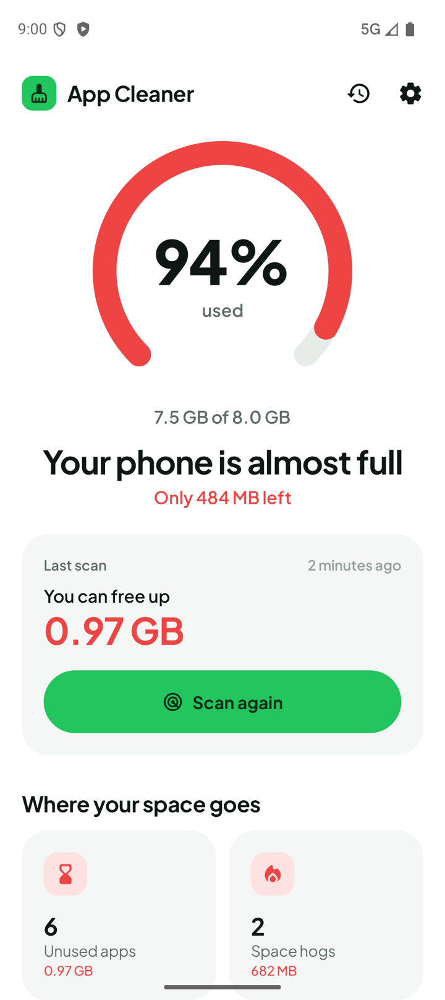 | 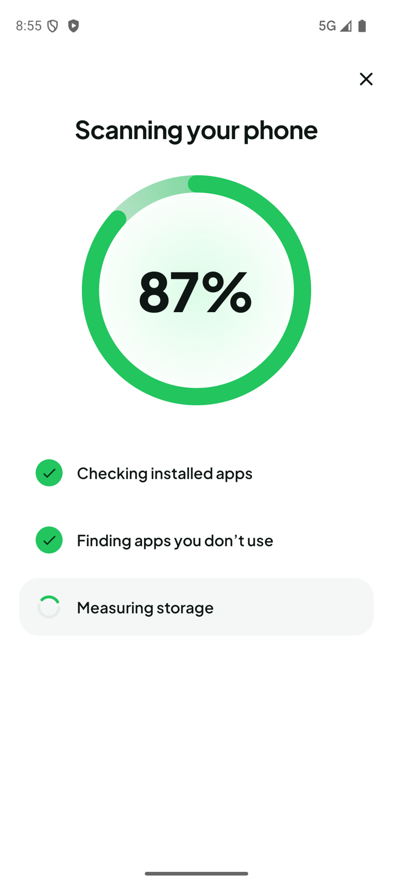 | 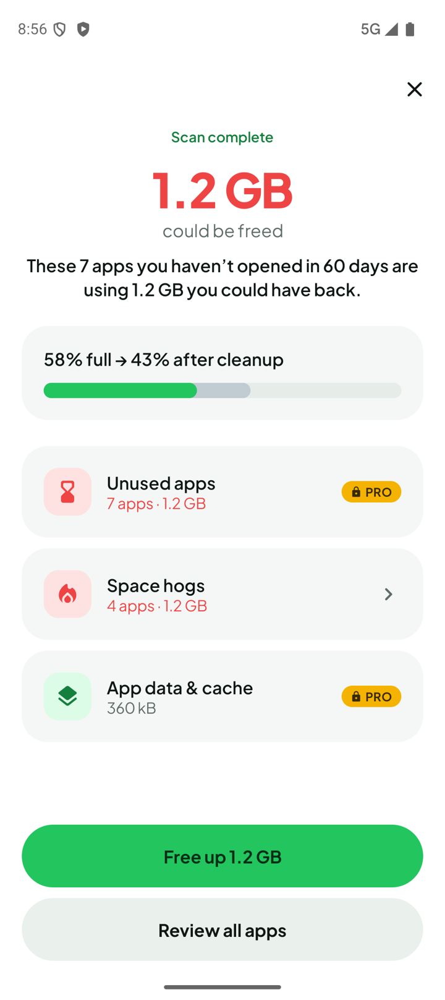 |
| Storage gauge turns red when the phone is almost full | One tap checks apps, usage and storage | What you could free, and how full the phone would be after |

| Unused | Large | Confirm |
|:--:|:--:|:--:|
| 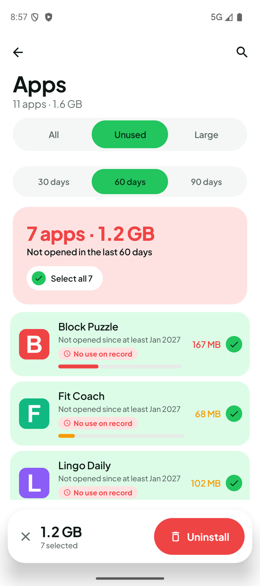 | 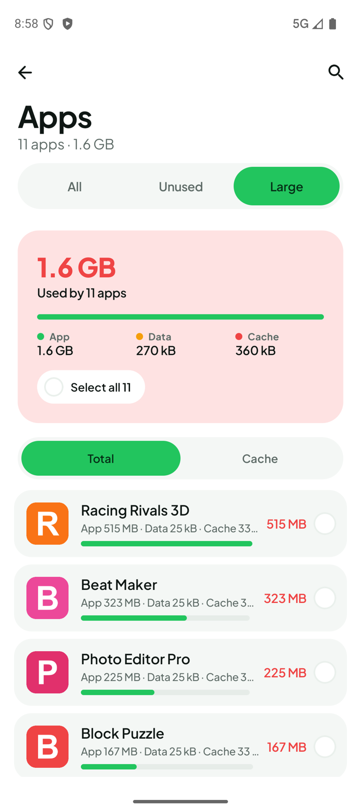 | 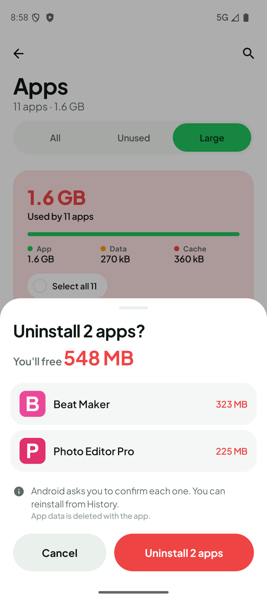 |
| Apps you haven't opened, pre-selected from the scan | App, data and cache size for every app | Confirming a batch |

| Result | History | Settings |
|:--:|:--:|:--:|
| 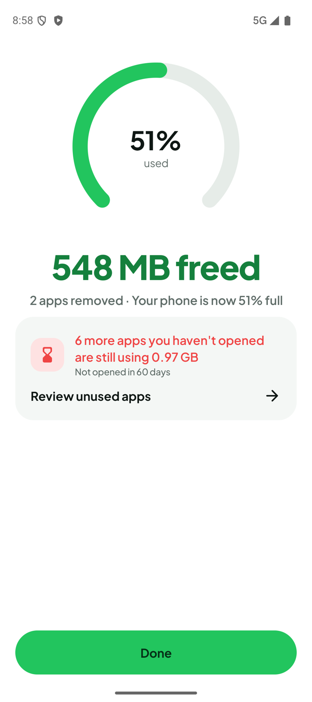 | 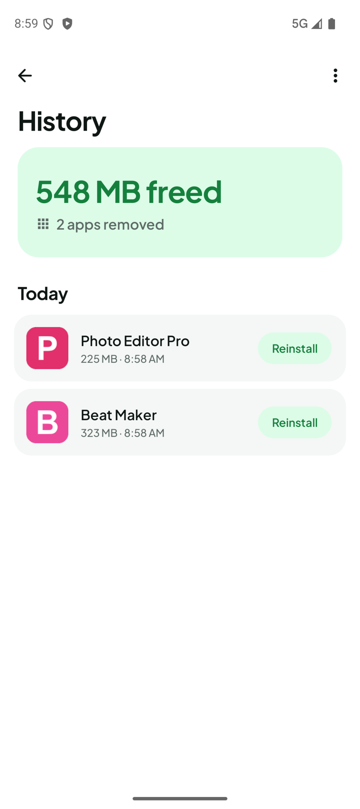 | 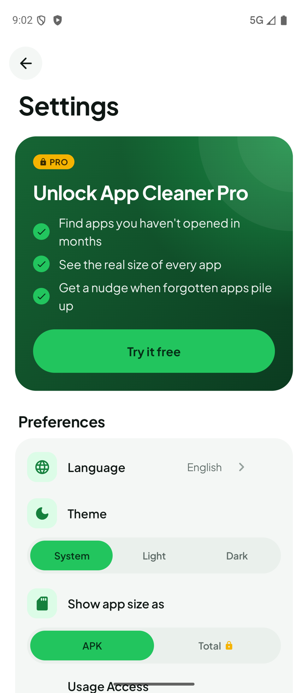 |
| Space freed, and what is still left to clean | History and Reinstall | Settings, with the Pro card for free users |

| Dark: Home | Dark: Scan result | Dark: Unused |
|:--:|:--:|:--:|
| 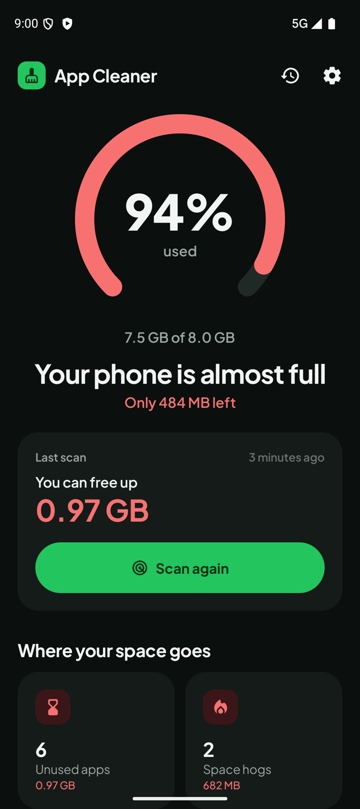 | 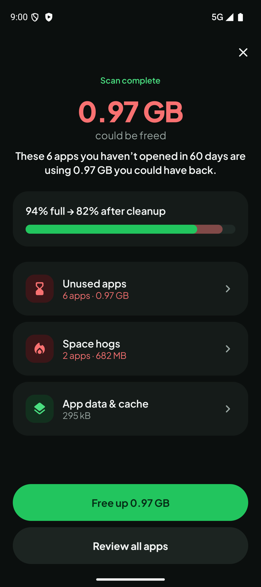 | 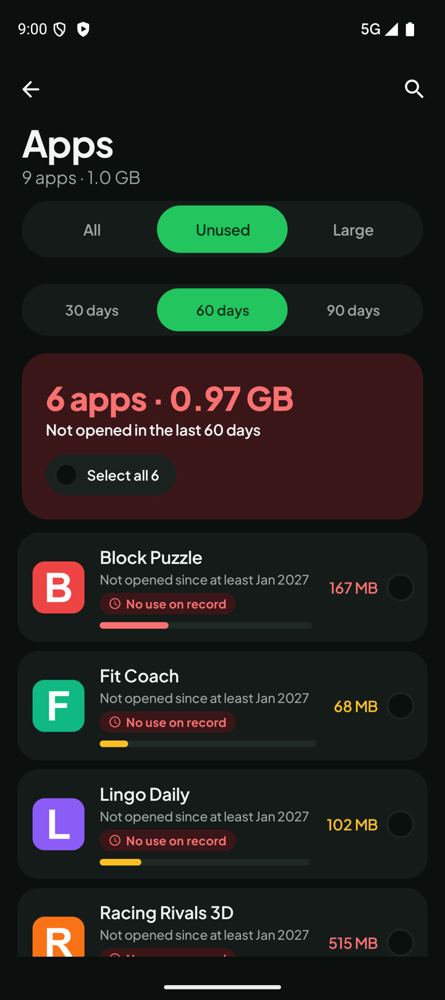 |
| Follows the system theme | | |

| Paywall |
|:--:|
| 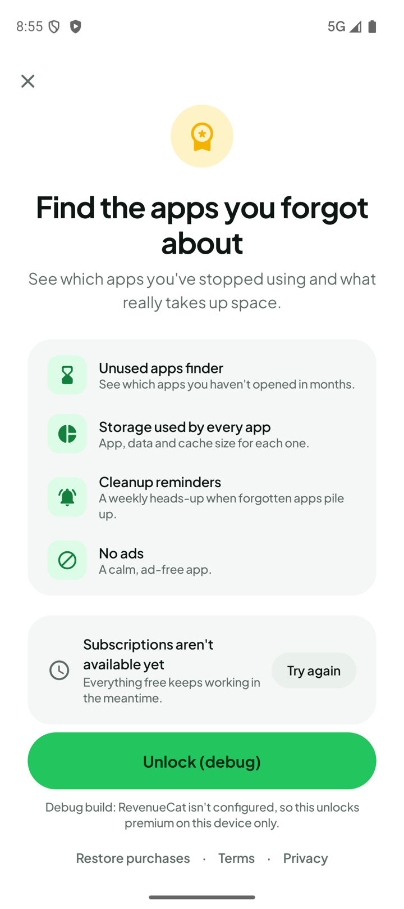 |
| Debug build: RevenueCat isn't configured yet, so the button unlocks Pro locally |

</div>

---

## Features

### Find
- Lists **every user-installed app**, including keyboards, widget packs and apps with no launcher icon
- System apps are hidden in V1, and App Cleaner never lists itself
- **Search** filters by app name and package name as you type
- **Sort** by size (largest first, the default), name, install date or last updated — Premium adds last used, and the choice is saved per tab
- **Cache-first list** — cold start renders from Room, then refreshes in the background; pull to refresh forces a full rescan
- Apps installed or removed while App Cleaner is open appear and disappear on their own
- **Storage card** with a segmented apps / other / free bar, sized with the same SI units as system Settings
- **App Details** from any row: version, install source, install date and last update, with Open, App info, View in Play Store and Uninstall

### Select
- **One selection** shared by every tab, search and sort — switching views never clears it
- The selection bar shows the count and total size, and says when search is hiding some of the selected apps
- The confirm sheet always lists **every** selected app, so nothing hidden is ever removed
- **Warning chips** on apps that are risky to remove: the current keyboard, launcher or SMS app, an active accessibility service or notification listener, a device admin — it warns, it doesn't block

### Remove
- Each app is handed to `PackageInstaller.uninstall()`, and **Android shows its own confirmation dialog**, one app after another
- A real result for every app: **removed**, **skipped** (you tapped Cancel) or **failed** (for example, blocked by device policy)
- Cancelling one app skips it and the batch carries on; the result screen offers **Try again**
- **Stop** ends the batch after the current dialog
- The queue lives in Room, so a batch cut short by a crash or a kill offers to **finish** on the next launch
- Uninstalling a single app from App Details goes through the same engine

### History
- Every removed app, grouped by day, with its icon, name, size and time, under a running total
- **Reinstall** opens the app's Play Store listing for apps installed from Play; an app that comes back is tagged *Reinstalled*
- Reinstalling brings the app back, not its data
- History is free

### Premium
A weekly subscription with a **3-day free trial**, through Google Play Billing and RevenueCat.

- **Unused apps finder** — apps you haven't opened in **30 days**, from Android's usage stats (needs Usage Access)
- An app installed inside the window is never called unused, and one with no usage record reads *Not opened since at least &lt;date&gt;* — never *Never opened*
- The default launcher, keyboard, SMS app and dialer, accessibility services, notification listeners and device admins are **never suggested** — they run without being opened
- **Cleanup reminders** — a weekly check that notifies only when the unused count has grown or 30 days have passed; the tap opens Unused apps with those apps pre-selected
- **No ads**
- Usage Access is asked for free, before any paywall, so a free user sees their real count — *14 apps · 3.4 GB* — over blurred rows before deciding to pay

### Free, beyond the basics
- **Heavy apps** — every app using 250 MB or more, with its app, saved-files and temp-files sizes (exact sizes need Usage Access)
- **Temp files** — how much each app keeps to open faster, with a shortcut to clear it in App info

### Elsewhere
- **9 languages**: English, Spanish, French, German, Mandarin, Hindi, Arabic, Hebrew and Russian — with full RTL layout for Arabic and Hebrew
- Language is switched **in-app**, independently of the system locale, and every language ships in every install
- **Light and dark** themes, following the system by default, overridable in Settings
- Red means remove: the red accent is used only for Uninstall and destructive confirmations
- Free users see ads, but **never on the uninstall path** — no ad between confirmation dialogs or before the result screen
- Free users get at most one generic cleanup nudge every 30 days, which needs no usage data
- **No connection gate** — ads, consent and the paywall price load when a connection exists

---

## How it works

**Android uninstalls; App Cleaner queues.** The app never removes a package itself. It passes
each selected package to `PackageInstaller.uninstall()` with an `IntentSender`. Android answers
with `STATUS_PENDING_USER_ACTION` and a confirmation intent, which App Cleaner launches — that is
the system dialog you see. The final status arrives on the same receiver: success, aborted (you
cancelled) or blocked. No Accessibility service taps "OK", and nothing needs root.

**Verify, then count.** A success status is not enough. Before an app is marked removed, the
engine checks that `PackageManager` no longer knows it — some OEM skins report success and keep
the app. Only verified removals reach History or the freed-space total. Then the next dialog opens.

**Measure before you delete.** Once a package is gone, its icon, label and size are gone from
`PackageManager` too. So each app's icon, label, installer and size are written to Room *before*
its dialog opens. The "2.4 GB freed" number and every History row are built from that snapshot.
Free users are measured by APK size, so their total reads "about".

**One dialog at a time, in the foreground.** The queue runs only while the progress screen is
visible. Leave the app and it pauses after the current dialog; come back and it resumes from the
first unfinished item. The queue is in Room, not memory, so rotation and process death don't lose it.

**The count before the price.** The Unused apps count is computed on-device for anyone who grants
Usage Access. The subscription only decides whether those rows render in clear and can be
selected. Heavy apps and Temp files are free.

---

## Architecture

Single-module Android app, MVVM, unidirectional data flow.

### Project structure

```
app/src/main/java/com/jedy/appcleaner/uninstaller/
├── core/
│   ├── analytics/      funnel events that can't carry a package name
│   ├── format/         byte formatting and analytics byte buckets
│   ├── locale/         the nine languages, in-composition switching, RTL
│   ├── model/          app, size and storage models shared by every feature
│   ├── selection/      the one global selection set
│   ├── startup/        process-start hooks contributed by features
│   └── ui/             theme (light and dark), shared components
├── data/
│   ├── billing/        the premium entitlement (RevenueCat)
│   ├── inventory/      installed apps from PackageManager, cached in Room
│   ├── local/          Room: inventory, sizes, uninstall queue, history
│   ├── prefs/          DataStore
│   ├── reminders/      weekly cleanup reminder and monthly nudge (WorkManager)
│   ├── storage/        device storage and per-app sizes (StorageStatsManager)
│   └── usage/          Usage Access and last-used data (UsageStatsManager)
├── di/                 Hilt modules
├── feature/
│   ├── history/        Uninstall History and Reinstall
│   ├── home/           app list, tabs, search, sort, storage card, App Details
│   ├── insights/       the Unused apps, Heavy apps and Temp files filters
│   ├── onboarding/     language picker, intro slides
│   ├── paywall/
│   ├── settings/
│   ├── uninstall/      confirm sheet, progress, result, resume banner
│   └── usageaccess/    the Usage Access disclosure
└── navigation/
```

**Features talk through contracts.** Each `data/` package exposes an interface — inventory, usage,
storage, reminders, premium — bound in Hilt. Features depend on those interfaces, never on each
other's implementations. Every Room table has one owning feature.

**Premium is one flag.** Outside the paywall and Settings, code reads a single `isPremium` state,
backed by the RevenueCat `premium` entitlement.

**Startup without edits.** A feature that must run at launch — configure billing, schedule a
worker, register a package receiver — contributes an `AppStartup` hook through Hilt instead of
editing the `Application` class.

### Stack

| | |
|---|---|
| Language | Kotlin 2.2.10 |
| UI | Jetpack Compose (BOM 2026.09.00), Material 3 |
| Build | AGP 9.4.1 with built-in Kotlin, KSP |
| DI | Hilt 2.60.1 |
| Persistence | Room 2.8.5, DataStore 1.2.1 |
| Navigation | navigation-compose 2.10.1 |
| Background | WorkManager 2.11 |
| Billing | RevenueCat Purchases 10.23.2 on Google Play Billing |
| Platform APIs | `PackageManager`, `PackageInstaller`, `UsageStatsManager`, `StorageStatsManager` |

---

## Building

Requires JDK 17+ (CI uses 21) and the Android SDK (compileSdk 37).

```bash
git clone git@github.com:mikedev08/App-Cleaner-Uninstall-Apps.git
cd App-Cleaner-Uninstall-Apps
./gradlew :app:assembleDebug
```

Install on a connected device:

```bash
./gradlew :app:installDebug
```

Run the unit tests:

```bash
./gradlew :app:testDebugUnitTest
```

The application ID is `com.jedy.appcleaner.uninstaller`.

### RevenueCat key (optional)

Subscriptions need a RevenueCat public SDK key. Add it to `local.properties` at the repo root.
That file is git-ignored; never commit the key.

```properties
revenuecat.apiKey=goog_…
```

It reaches the code as `BuildConfig.REVENUECAT_API_KEY`. Without it the app runs normally; billing
is simply not configured. To test premium without a key, debug builds have a **Force premium**
switch in Settings.

> **Note on the build.** AGP 9 ships with Kotlin built in, so the `org.jetbrains.kotlin.android`
> plugin must **not** be applied — doing so fails with *"Cannot add extension with name 'kotlin'"*.
> For the same reason `android.disallowKotlinSourceSets=false` is set in `gradle.properties`,
> which KSP still needs under built-in Kotlin. Hilt must be 2.60+; 2.57.x fails against AGP 9
> with *"Android BaseExtension not found"*.

---

## Testing

Unit tests run on the JVM with JUnit 4, Robolectric, Turbine and kotlinx-coroutines-test.

```bash
./gradlew :app:testDebugUnitTest
```

The priority is the logic that decides what gets removed and what gets reported, where a silent
regression would do real harm:

| Area | What it protects |
|---|---|
| Unused rule | the 30 / 60 / 90-day threshold, the install-date guard, the always-running exclusions |
| Uninstall queue | per-app states, skip and continue, resume after a kill, verification after success |
| Freed-space total | only verified removals count; apps already gone are excluded |
| Analytics events | no field carries a package name or label; bytes are bucketed |
| Selection | one set across tabs, search and sort; hidden selections still reach the confirm sheet |
| Locale | the `iw` / `he` Hebrew tag split |

---

## Continuous integration

`.github/workflows/android-ci.yml` runs on every pull request and on every push to `main`:

1. Build the debug APK — `./gradlew :app:assembleDebug`
2. Unit tests — `./gradlew :app:testDebugUnitTest`
3. Lint — `./gradlew :app:lintDebug`

The debug APK is uploaded as a workflow artifact for 14 days, so a PR can be tried on a device
without building it locally. On failure, the build reports and test results are uploaded too. A
new push to the same PR cancels the run it replaces.

---

## Status

V1 is in development against the PRD in `docs/prd/` (v1.2, as `.docx` and `.pdf`, generated from
`prd_content.py`). Every V1 screen is built and runs end to end on a device: onboarding, Home
with the storage gauge, Scan, the Apps list with the All, Unused apps, Heavy apps and Temp files filters, batch uninstall
with its result, Uninstall History, Usage Access, the paywall and Settings, in light and dark and
in all nine languages (Arabic and Hebrew mirrored).

Known gaps, honestly stated:

- **RevenueCat has no API key yet.** Without `revenuecat.apiKey` in `local.properties`, the paywall shows "Subscriptions aren't available yet", and debug builds get an "Unlock (debug)" button that turns Pro on locally.
- **Translations are machine-written.** The seven non-English languages still need a native review.
- **Firebase, consent and ads are not in the build yet.** Firebase Analytics and Crashlytics, Google UMP and the ad units are specified in the PRD; until Firebase is bound, analytics go to logcat.
- **Room migrations are destructive.** The schema is still at version 1 and drops its tables on change. Real migrations come before release.
- **The in-app language is not in system settings.** It is applied inside the composition, so it does not appear on Android 13's per-app language page.

Out of scope for V1, on purpose: app archiving, Accessibility auto-uninstall, APK backup, system
apps and bloatware, junk or cache cleaning, yearly and lifetime plans, work-profile apps, a
permission audit, and a home-screen widget.

---

## Privacy

No account, no login, no server. The installed-app list, usage timestamps and storage sizes are
read, computed and stored on the device, and never uploaded. In the Play Data safety form,
installed apps and app interactions are declared as processed on-device, not collected.

Analytics never carry a package name or an app label. Every event is an `AnalyticsEvent` whose
fields are counts, flags, fixed categories and byte buckets (`<100MB`, `100MB-500MB`, …). Crash
reports follow the same rule. Events go through a local `Analytics` interface; as of this commit,
its only implementation writes to logcat.

Usage Access is explained in the app before you are sent to Settings. It is re-checked every time
the app resumes: revoke it and Unused apps and Temp files go back to asking, and cached sizes are
cleared.

### Permissions

| Permission | Why |
|---|---|
| `QUERY_ALL_PACKAGES` | Lists every installed app, including keyboards and apps with no launcher icon; declared to Play as the app's core purpose. |
| `REQUEST_DELETE_PACKAGES` | Lets the app call `PackageInstaller.uninstall()`; Android still asks you to confirm every app. |
| `PACKAGE_USAGE_STATS` | Usage Access, which you grant in Settings; powers the Unused finder and the per-app storage breakdown. |
| `POST_NOTIFICATIONS` | Cleanup reminders and the monthly nudge; asked for when you tap *Get Started*. |
| `INTERNET` | Subscriptions (RevenueCat and Play Billing), with `ACCESS_NETWORK_STATE`; uninstalling never needs a connection. |

Not requested: an Accessibility service, `MANAGE_EXTERNAL_STORAGE`, or root.
